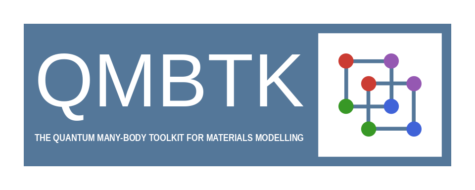

# 
 QMBTK 

## 
 Quantum Many-Body Toolkit for Materials Modelling 

<!-- ## About-->

This GitHub organization aims to collect a set of efficient, high-performance, reduced-cost, and highly scalable tools for quantum mechanical first-principle many-body calculations of solids at the atomic scale. The goal is to establish a toolkit of packages for predictive materials modeling. 

A cornerstone of this organization will be the implementation of a coupled cluster code for large periodic simulation cells containing about 1000 correlated electrons. The main programming language will be Julia.

Join us in advancing computational materials modeling.

  

